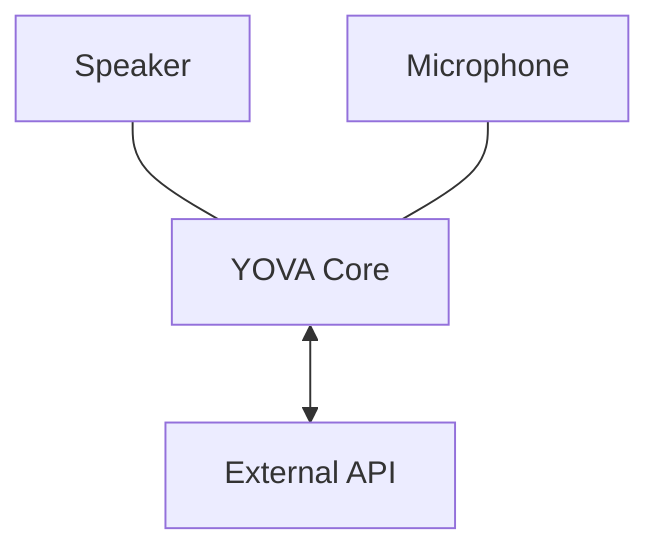

# YOVA - Your Own Voice Assistant

YOVA is an open-source voice interface you can connect to any AI backend. It listens to speech, turns it into text, sends it to your API (ChatGPT, custom agents, n8n, or anything else), and then speaks back the response.

The idea is simple: you focus on building the brain, YOVA handles the ears and mouth. It takes care of speech recognition, text-to-speech, and streaming so conversations feel natural and responsive.

By keeping latency low and supporting flexible endpoints (including REST and WebSockets), YOVA makes it easy to add real-time voice interaction to your applications without dealing with audio processing details.

