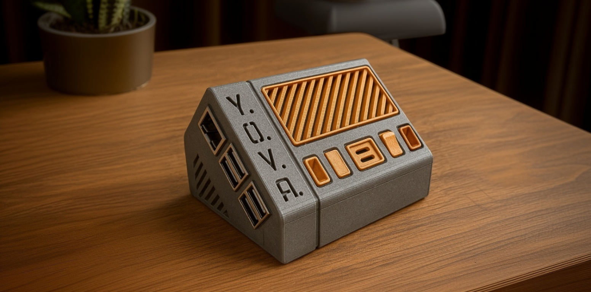

# YOVA - Your Own Voice Assistant

YOVA is an open-source voice interface you can connect to any AI backend. It listens to speech, turns it into text, sends it to your API (ChatGPT, custom agents, n8n, or anything else), and then speaks back the response.

It's Raspberry Pi–based and ships with 3D-printed case files so you can assemble a compact, standalone device.

The idea is simple: **you focus on building the brain**, YOVA handles the ears and mouth. It takes care of speech recognition, text-to-speech, and streaming so conversations feel natural and responsive.

By keeping latency low and supporting flexible endpoints (including REST and WebSockets), YOVA makes it easy to add real-time voice interaction to your applications without dealing with audio processing details.

## What makes YOVA useful:
 - **Runs on Raspberry Pi**: lightweight enough for edge devices, always ready to listen.
 - **Compact form factor**: a small device you can keep on your desk, in your room, or integrate into other projects.
 - **Multi-language support**: supports multiple languages for speech recognition and text-to-speech, making it convenient for users worldwide.
 - **3D printed case**: comes with customizable 3D models so you can print your own version or tweak the design.
 - **[Voice ID](docs/voice_id.md)**: biometric identification of users by voice for personalization and access control.
 - **Modular architecture** - add plugins, extensions, or connect other hardware without rewriting the core. (e.g. add a camera, a screen, a speaker, a button, etc.)
 - **Flexible integration**: connect it to any backend you want to build.
 - **Ready after install** ships with a working ChatGPT integration as a simple example, so you can start using it right away.

## Performance

YOVA is designed for low-latency voice interactions. Current performance metrics show:
- **Input latency**: ~60ms median from button press to recording start
- **Question processing**: ~500ms median from speech end to API call
- **Answer playback**: ~700ms median from API response to speech start (can be made to feel even better with proper UX strategies)

For detailed performance analysis, optimization strategies, and pro tips, see the [Performance Guide](docs/performance.md).

## Getting Started

To get started with YOVA, you'll need a Raspberry Pi 5 and a ReSpeaker 2-Mic HAT. The installation process involves:

1. **[Hardware Assembly](docs/install.md)** - 3D print the case and assemble the components
2. **[Software Installation](docs/install.md)** - Run the automated install script on your Raspberry Pi
3. **[Configuration](docs/config.md)** - Connect to built-in ChatGPT backend for testing
4. **[Integration](docs/integration.md)** - Connect to your custom backend API

For detailed step-by-step instructions, see the [Installation Guide](docs/install.md).
