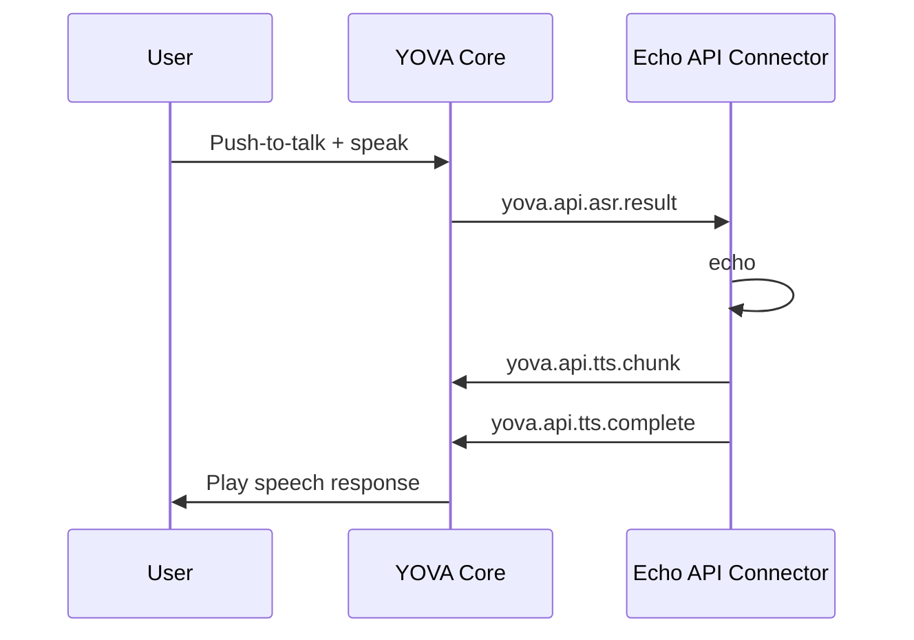

# Getting Started - API Connector Example

## Overview

This guide shows you how to build your own API Connector to integrate YOVA with your backend API. We'll create an **Echo Connector** - a simple connector that repeats back whatever you say to it.

## Why Build an Echo Connector?

We're building an echo connector instead of connecting to a real backend API for simplicity. This approach lets you focus on learning the integration mechanics without worrying about backend development. Once you understand how it works, you can easily extend it to connect to your actual API.

## How It Works

Here's the flow of our echo connector:

> **💡 Tip**: For a deeper understanding of how YOVA components interact, see the [Architecture Overview](architecture.md).



## Step-by-Step Implementation

### Step 1: Create the Project Structure

First, create a folder for your connector:

```bash
mkdir custom_api_echo
cd custom_api_echo
```

Create a basic `main.py` file:

```python
def run():
    print("Hello from the Echo API Connector")

if __name__ == "__main__":
    run()
```

### Step 2: Add to Project Configuration

Edit your `pyproject.toml` to include the new connector:

```toml
[tool.poetry.scripts]
# ... existing scripts ...
custom-api-echo = "custom_api_echo.main:run"
```

Install the connector:

```bash
make install-dev
```

Test it:

```bash
poetry run custom-api-echo
```

You should see: `Hello from the Echo API Connector`

### Step 3: Implement the Core Functionality

Replace the contents of `main.py` with the full implementation:

```python
from yova_shared.broker import Publisher, Subscriber
import asyncio
import uuid

# Punctuation marks that indicate the end of a sentence
SENTENCE_ENDINGS = ['.', '!', '?', ':', ';']

async def main():
    print("Hello from the Echo API Connector")

    # Initialize publisher and subscriber for message broker communication
    publisher = Publisher()
    subscriber = Subscriber()

    # This function processes incoming speech recognition results
    async def on_asr_result(topic, message):
        print(f"Received ASR result: {message}")
        
        # Extract the transcribed text from the message
        transcript = message["data"]["transcript"]

        # Generate a unique ID for this conversation turn
        message_id = str(uuid.uuid4())

        # Break down the transcript into sentences for natural speech
        current_sentence = ""
        for char in transcript:
            current_sentence += char
            # Send each complete sentence as a TTS chunk
            if char in SENTENCE_ENDINGS:
                await publisher.publish("yova.api.tts.chunk", {
                    "id": message_id, 
                    "content": current_sentence,
                    "priority_score": 0
                })
                current_sentence = ""

        # Send any remaining text as a final chunk
        if current_sentence:
            await publisher.publish("yova.api.tts.chunk", {
                "id": message_id, 
                "content": current_sentence,
                "priority_score": 0
            })

        # Signal that all chunks have been sent
        await publisher.publish("yova.api.tts.complete", {
            "id": message_id, 
            "content": transcript
        })
        
    # Set up the subscriber to listen for speech recognition results
    await subscriber.connect()
    await subscriber.subscribe("yova.api.asr.result")
    print("Listening for ASR results...")
    await subscriber.listen(on_asr_result)

def run():
    asyncio.run(main())   

if __name__ == "__main__":
    run()
```

Test your connector:

```bash
poetry run custom-api-echo
```

You should see:
```
Hello from the Echo API Connector
Listening for ASR results...
```

Press `Ctrl+C` to stop.

### Step 4: Configure Supervisor

Update `configs/supervisord.conf` to use your new connector. Find the `yova-api-openai` section and replace it with:

```conf
[program:yova_api]
command=poetry run custom-api-echo
```

Restart the supervisor daemon to apply changes:

```bash
make supervisor-stop
make supervisor-start
```

### Step 5: Test the Full System

Start the YOVA system:

```bash
make supervisor-dev
```

Check that there are no `[yova_api]` errors. You should see:

```
==================================================
SUPERVISOR STATUS
==================================================
yova_api                         RUNNING   pid 71116, uptime 0:00:08
```

In another terminal, start the development tools:

```bash
make dev-tools
```

**Test your connector:**
1. Press spacebar to start recording
2. Say something (e.g., "Hello, this is a test")
3. Press spacebar again to stop recording
4. You should hear the same text played back to you

## Understanding the Code

### Key Components

- **Publisher**: Sends messages to other YOVA components (like the text-to-speech system)
- **Subscriber**: Receives messages from other components (like the speech recognition system)
- **Message Broker**: Handles communication between all YOVA components

### Message Flow

1. **Input**: User speaks → YOVA Core transcribes speech → sends `yova.api.asr.result`
2. **Processing**: Your connector receives the transcript and processes it
3. **Output**: Sends text chunks via `yova.api.tts.chunk` → sends completion via `yova.api.tts.complete`
4. **Playback**: YOVA Core plays the audio response

> **📚 Reference**: For a complete list of all available events and their payloads, see the [Events Reference](events.md).

### Sentence Breaking

The connector breaks transcripts into sentences using punctuation marks. This creates natural speech patterns instead of sending the entire transcript at once.

## Next Steps

Now that you have a working echo connector, you can:

1. **Connect to a Real API**: Replace the echo logic with HTTP requests to your backend
2. **Add Business Logic**: Process user input and generate meaningful responses
3. **Handle Errors**: Add error handling for API failures or network issues
4. **Add Authentication**: Include API keys or tokens for secure communication

> **🔗 Related Documentation**: 
> - [Architecture Overview](architecture.md) - Learn about YOVA's system architecture and components
> - [Events Reference](events.md) - Complete list of events and their payloads

## Troubleshooting

- **Supervisor errors**: Check the supervisor logs with `make supervisor-status`
- **No audio response**: Verify the connector is running and receiving ASR results
- **Connection issues**: Ensure the message broker is running properly

The echo connector demonstrates the fundamental pattern for integrating external APIs with YOVA. Once you're comfortable with this example, you'll be ready to build more sophisticated integrations!
