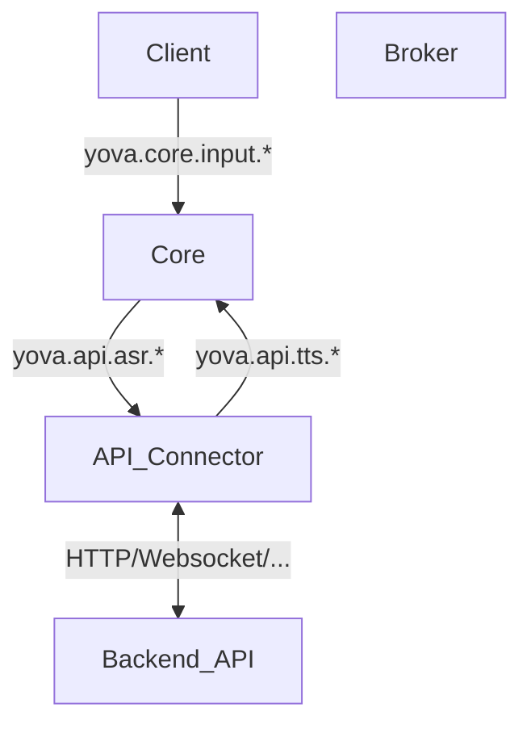

# Architecture Overview

## System Architecture Diagram

The diagram below shows a simplified flow of the main events between components. For a complete list of all available events and their detailed specifications, see [Events Documentation](events.md).

## Component Details

For detailed information about all events and their data structures, see [Events Documentation](events.md).

### Client
- **Role**: Handles user input through push-to-talk button and may provides visual feedback
- **Events**: 
  - Publishes `yova.core.input.state` to indicate button activation status
  - May subscribe to system events for visual feedback (LED indicators, status displays)
- **Features**: 
  - Push-to-talk button handling
  - Optional LED animations (welcome, thinking, listening, speaking)
  - Optional visual status indicators for system states
- **Communication**: One way or Bidirectional communication with the broker
- **Implementation**: Can be replaced with custom implementations (e.g., `yova_client_respeaker_hat` uses APA102 LED strip with custom animations)

### Core
- **Role**: Central speech processing system
- **Subscriptions**: 
  - `yova.api.tts.chunk` - receives text chunks for speech conversion
  - `yova.api.tts.complete` - signals completion of text-to-speech requests
- **Publications**: 
  - `yova.api.asr.result` - publishes voice command transcriptions
- **Functionality**: Handles speech recognition and text-to-speech conversion

### API Connector
- **Role**: Bridge between YOVA system and external backend APIs
- **Subscriptions**: 
  - `yova.api.asr.result` - receives voice command transcriptions
- **Publications**: 
  - `yova.api.tts.chunk` - sends text chunks for speech conversion
  - `yova.api.tts.complete` - signals completion of response chunks
- **External Communication**: Sends HTTP requests to backend APIs and processes responses

### Backend API
- **Role**: External service that processes voice commands and generates responses
- **Communication**: 
  - Receives requests from API Connector (async or sync)
  - Sends responses back to API Connector
  - Can send responses without requests (push notifications)
  - Communication is asynchronous and bidirectional
  - Requests don't require responses

### Broker
- **Role**: Central event distribution system using ZeroMQ
- **Pattern**: XPUB/XSUB architecture
- **Ports**: 
  - Frontend (5555): Publishers connect here
  - Backend (5556): Subscribers connect here
- **Functionality**: Routes all events between components without persistence

## Principles of Architecture
- **Modular processes**  
  The system is split into small, stateless Python modules. Each module can be swapped or replaced without impacting others.  
- **Event-driven communication**  
  Modules communicate only via local [ZeroMQ](https://zeromq.org/) PUB/SUB events. No shared state.  
- **Orchestration with Supervisor**  
  [supervisord](http://supervisord.org/) manages lifecycle, restarts, and logging of all processes. A lightweight web UI is available for monitoring.  
- **Replaceability & simplicity**  
  Modules are designed to be plug-and-play: single-purpose, self-contained, and without external dependencies beyond the shared virtualenv.  
- **Local-first**  
  Runs entirely on a Raspberry Pi, no external infrastructure required.

## Focus
- **Flexibility**: Each module can be replaced with a different implementation.
- **Resilience**: Each process runs independently. Failures are contained, supervisor auto-restarts modules.  
- **Maintainability**: Clear contracts between modules (events + topics). Minimal coupling.  
- **Lightweight footprint**: Optimized for Raspberry Pi hardware. Avoids heavy brokers/databases.  
- **Transparency**: Logs for each module go to separate files for easier debugging and audit.  

## Known Issues / Limitations
- **Message delivery**: ZeroMQ PUB/SUB is best-effort. Messages can be dropped under backpressure or if a subscriber is late to join.  
- **No persistence**: Events are not stored or replayed. If a module is offline, it misses messages.  
- **Observability gaps**: Logs are split per file and stored locally (risk of SD card wear). No centralized metrics or tracing yet.  
- **Supervisor limitations**: supervisord is not a full init system. It’s run under systemd but lacks per-process resource isolation.  