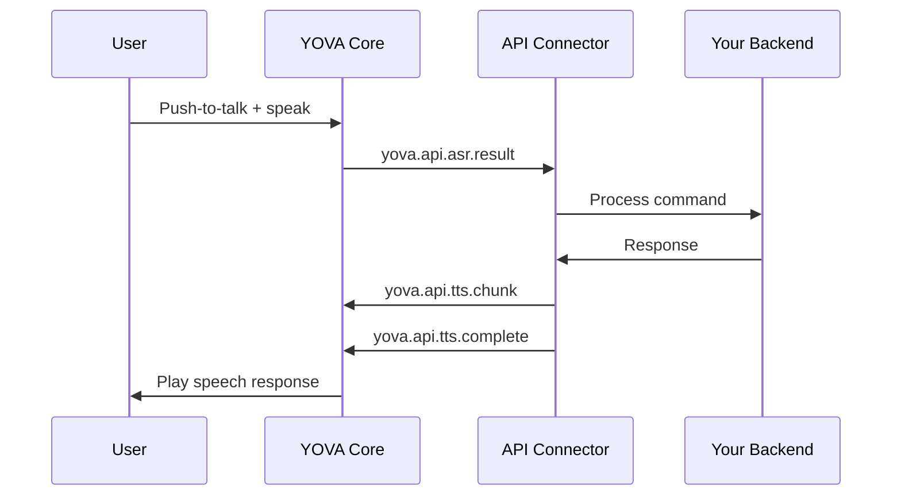

# Backend Integration Guide

This guide explains how to integrate your backend service with YOVA using different transport methods. The integration follows a simple pattern where your service subscribes to voice commands and publishes speech responses.

## Integration Pattern

The basic integration follows this flow:

1. **Subscribe** to `yova.api.asr.result` to receive voice command transcriptions
2. **Process** the voice command in your backend service
3. **Publish** `yova.api.tts.chunk` for each response chunk
4. **Publish** `yova.api.tts.complete` when the response is finished

## Event Flow

## Related Documentation

- [Architecture Overview](architecture.md) - Learn about YOVA's system architecture and components
- [Events Reference](events.md) - Complete list of events and their payloads